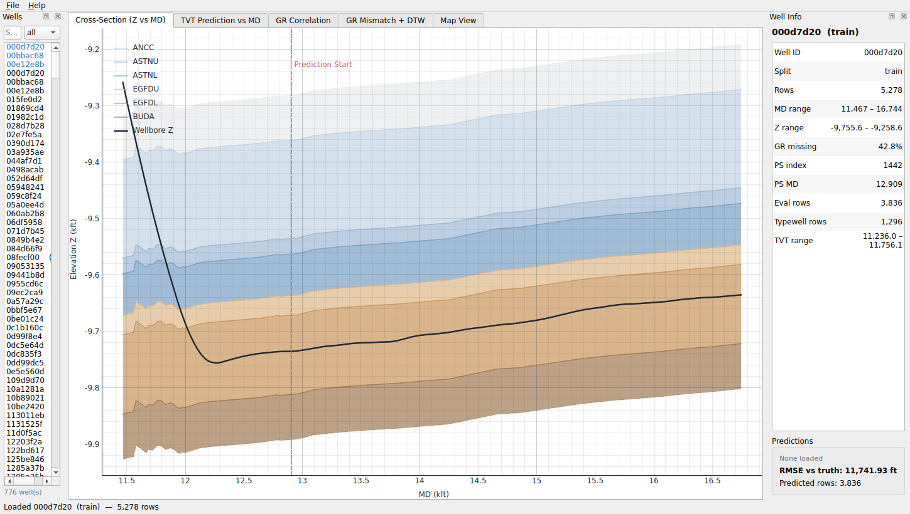
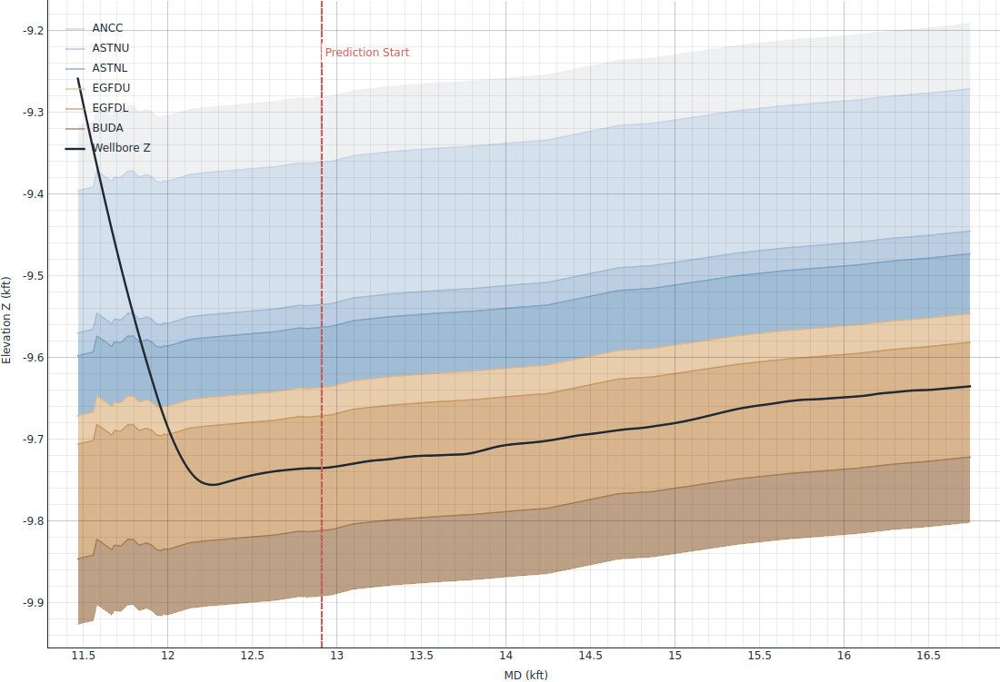
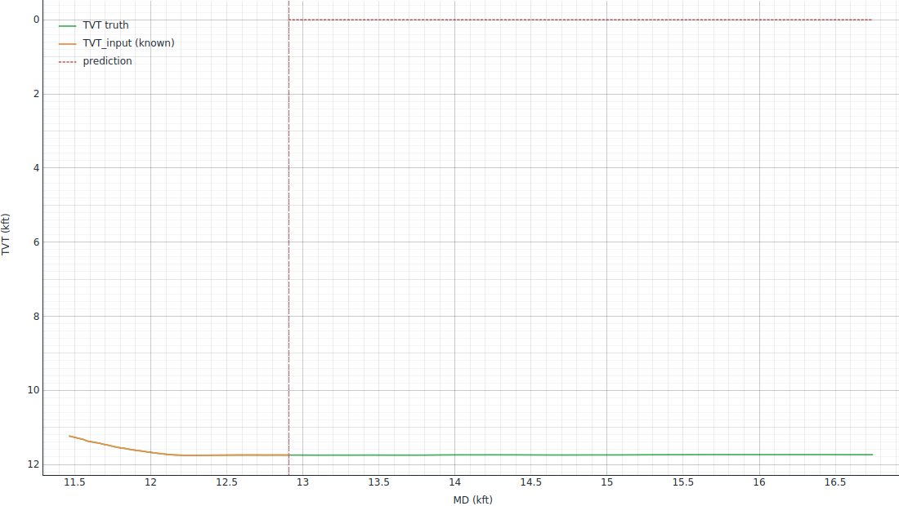
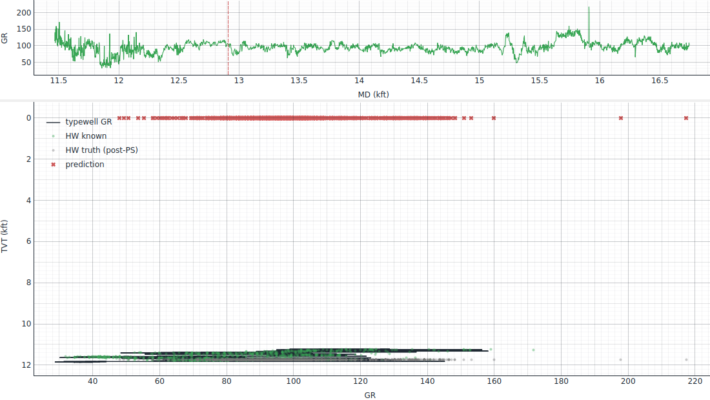
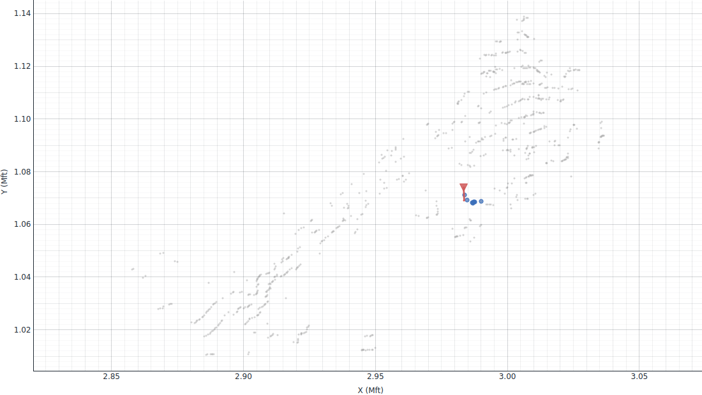

# ROGII Viewer

A lightweight desktop geosteering viewer for the
[ROGII — Wellbore Geology Prediction](https://www.kaggle.com/competitions/rogii-wellbore-geology-prediction)
Kaggle competition dataset. Inspired by ROGII's commercial **StarSteer** software, this is a free open-source
tool that lets you browse all 773 training wells (and any number of test wells), inspect the geological
cross-section along each wellbore, correlate gamma-ray signatures against the typewell, and **load any
Kaggle-format predictions CSV to see how your model is doing against the truth, well by well.**



---

## Features

- **Per-well loader** — scan a dataset folder and browse all train + test wells with search and split filter.
- **Cross-section view** — wellbore Z elevation plotted against MD, with the six formation tops (`ANCC`,
  `ASTNU`, `ASTNL`, `EGFDU`, `EGFDL`, `BUDA`) rendered as color bands so you can immediately see which
  geological layer the lateral is drilling through.
- **TVT prediction view** — overlay truth, `TVT_input`, and your predicted `TVT` on the same MD axis with
  the Prediction Start marker; RMSE is computed instantly when truth is available.
- **GR correlation view** — typewell GR vs TVT alongside the horizontal-well GR; supports overlaying
  predicted-TVT scatter for sanity checking signal alignment.
- **Map view** — XY trajectories of every well, with the active well highlighted and the 8 nearest
  neighbours called out (offset-well exploration).
- **Kaggle-format predictions CSV loader** — drag in any `submission.csv` with columns `id,tvt` (where
  `id = <well_id>_<row_index>`); aligns automatically and shows per-well RMSE.
- **Export to PNG** — Ctrl+E saves the active tab as a PNG.
- **Single-file Windows .exe** — included PyInstaller spec produces a portable `ROGIIViewer.exe`.

---

## Screenshots

### Cross-section with formation-top bands


### TVT prediction overlay (truth vs `TVT_input` vs prediction)


### GR correlation — typewell GR (black) vs horizontal-well GR (green) and prediction (red)


### Map view — every well centroid, with the active well + 8 nearest neighbours


---

## Quickstart (from source)

### 1. Clone the repo

```bash
git clone https://github.com/tom99763/rogii-viewer.git
cd rogii-viewer
```

### 2. Install dependencies

Requires Python 3.10+.

```bash
pip install -r viewer/requirements.txt
```

### 3. Download the dataset

The Kaggle dataset is not bundled in this repo (~800 MB). Download it via the Kaggle CLI:

```bash
kaggle competitions download -c rogii-wellbore-geology-prediction
unzip rogii-wellbore-geology-prediction.zip -d rogii-wellbore-geology-prediction/
```

The viewer auto-loads `~/ROGII/rogii-wellbore-geology-prediction/` if it exists; otherwise use
**File → Open dataset folder…** and pick any folder that contains `train/` and/or `test/` subfolders
with `<well_id>__horizontal_well.csv` and `<well_id>__typewell.csv` pairs.

### 4. Run

```bash
python -m viewer
```

---

## Loading a predictions CSV

`File → Load predictions CSV…` accepts the exact format Kaggle expects for this competition:

```
id,tvt
000d7d20_1442,11236.02
000d7d20_1443,11237.05
...
```

`id` decomposes as `<well_id>_<row_index>`. The viewer:

1. Parses and groups by `well_id`.
2. When you click a well, overlays the prediction as a red dotted line on the **TVT Prediction** tab
   and as red X markers on the **GR Correlation** tab.
3. If the active well is a training well (truth available), shows
   `RMSE vs truth: <value> ft` in the right info panel.

This is the easiest way to spot per-well failure modes that an aggregate Kaggle leaderboard score hides.

---

## Building the Windows .exe

The repo ships with `viewer/build.bat`. Run it from a **Windows** shell with a Windows Python install:

```cmd
cd path\to\rogii-viewer
viewer\build.bat
```

This calls PyInstaller with the right flags and produces `dist\ROGIIViewer.exe` (~80 MB; bundles
PySide6 + pyqtgraph + NumPy + pandas). Drop it on any Windows machine and double-click.

> **Note:** PyInstaller can only produce executables for the OS it runs on. To build a Linux/macOS
> binary, run `build.bat`'s equivalent on that platform — substitute the slashes and drop `.bat`.

---

## Repository layout

```
.
├── viewer/                      # Desktop viewer (this app)
│   ├── __main__.py              # python -m viewer entry
│   ├── app.py                   # MainWindow + menus + dock panels
│   ├── plots.py                 # CrossSection / GRCorrelation / Map / TVTPrediction widgets
│   ├── data.py                  # DatasetIndex + WellBundle + Predictions loaders
│   ├── smoke_test.py            # offscreen test (CI-friendly)
│   ├── requirements.txt
│   ├── build.bat                # Windows .exe packaging
│   └── docs/                    # screenshots for this README
├── report/                      # Knowledge-base HTML reports (+ CSVs)
│   ├── index.html               # ← start here: consolidated front page
│   ├── eda_report.html          # deep EDA over all 773 wells
│   ├── competition_overview.html# inverse-problem framing + method portfolio (MathJax)
│   ├── generate_index.py        # rebuilds index.html
│   ├── generate_report.py       # rebuilds eda_report.html
│   ├── generate_overview.py     # rebuilds competition_overview.html
│   ├── well_summary.csv         # one row per horizontal well, ~30 features
│   ├── typewell_summary.csv
│   ├── baseline_rmse.csv        # RMSE floors for 3 trivial baselines
│   ├── geology_counts.csv
│   └── test_nearest_neighbours.csv
├── notebook/
│   └── eda-starter.ipynb        # the Kaggle-provided starter notebook
├── README.md                    # ← you are here
├── LICENSE                      # MIT
└── .gitignore
```

---

## The dataset in one paragraph

Each well comes as two CSV files. `<well_id>__horizontal_well.csv` is the lateral well log sampled every
1 ft of measured depth (`MD`), with columns `MD, X, Y, Z, GR, TVT_input` always present; training files
additionally contain `TVT` (the target) and six formation-top elevations (`ANCC, ASTNU, ASTNL, EGFDU,
EGFDL, BUDA`). `<well_id>__typewell.csv` is a paired vertical reference log sampled at 0.5 ft of TVT
with `TVT, GR, Geology`. The goal is to predict `TVT` for every row after the **Prediction Start (PS)**
point — where `TVT_input` becomes `NaN` — typically the last ~73% of each well. Evaluation is RMSE.

For a fuller picture, open `report/eda_report.html` — it covers PS distribution, GR missingness patterns,
baseline RMSE floors per well, the geology vocabulary, and modeling recommendations.

---

## Tech stack

- **GUI**: [PySide6](https://wiki.qt.io/Qt_for_Python) (Qt 6 bindings)
- **Plots**: [pyqtgraph](https://www.pyqtgraph.org/) for GPU-accelerated 2D rendering
- **Data**: NumPy + pandas
- **Packaging**: PyInstaller (`--onefile --windowed`)

---

## Limitations / roadmap

- No real-time survey ingestion or WITSML support — this is a viewer, not a live geosteering platform.
- No 3D view (yet); the cross-section is 2D Z-vs-MD with formation-top bands.
- No DTW or correlation toolkit built into the GUI — those should live in your modeling pipeline.
- Predictions CSV is read-only; the viewer doesn't author submissions.

PRs welcome.

---

## Acknowledgments

- [ROGII](https://www.rogii.com/) for the dataset and for inspiring the viewer's layout via their
  StarSteer product.
- The [Kaggle competition page](https://www.kaggle.com/competitions/rogii-wellbore-geology-prediction)
  for the problem framing and the slide deck that ships with the data.

## License

MIT — see [LICENSE](LICENSE).
